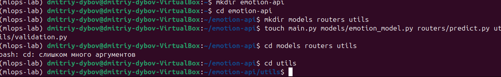
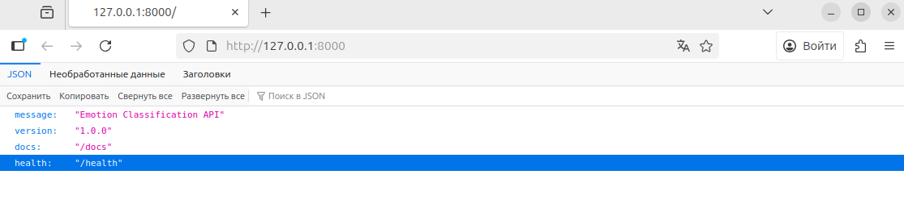
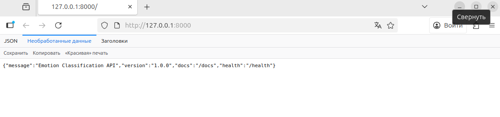
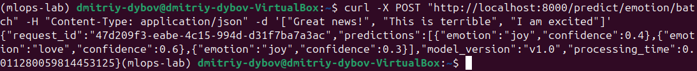
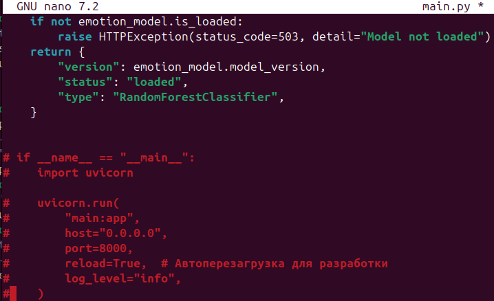
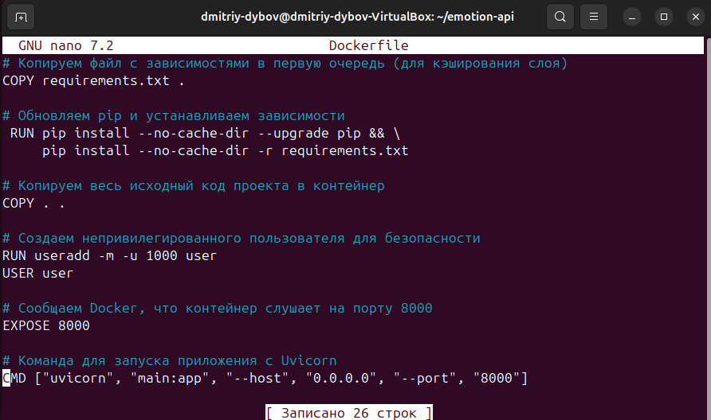
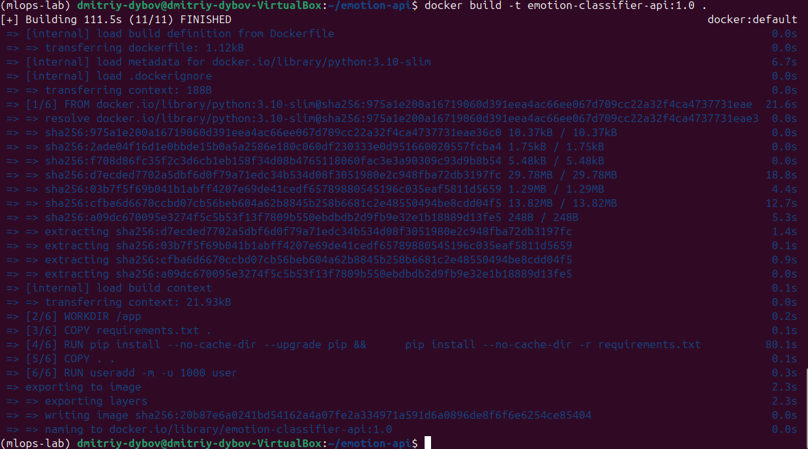
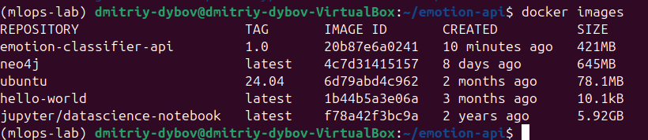
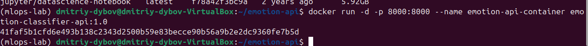

# МИНИCTEPCTBO НАУКИ И ВЫСШЕГО ОБРАЗОВАНИЯ РОССИЙСКОЙ ФЕДЕРАЦИИ
## Федеральное государственное автономное образовательное учреждение высшего образования «Северо-Кавказский федеральный университет» 
### Институт перспективной инженерии
### Отчет по лабораторной работе 5
### Развертывание ML-моделей с FastAPI. Контейнеризация ML-сервиса с Docker. Тестирование работоспособности API через Swagger UI
Дата: 2025-11-26 \
Семестр: [2 курс 1 полугодие - 3 семестр] \
Группа: ПИН-м-о-24-1 \
Дисциплина: Технологии программирования \
Студент: Дыбов Д.В.

#### Цель работы
Освоение базовых принципов разработки production-ready веб‑сервисов для обслуживания ML‑моделей с использованием FastAPI; контейнеризация ML‑сервиса с помощью Docker; тестирование и валидация RESTful API через автоматически генерируемую документацию Swagger UI.

#### Теоретическая часть
##### Краткие изученные концепции:
- FastAPI: создание эндпоинтов, валидация входных данных через Pydantic, автоматическая генерация OpenAPI/Swagger UI.
- Docker: написание Dockerfile, .dockerignore, сборка образов, запуск контейнеров, оптимизация размера образа (многоступенчатая сборка).
- Swagger UI / OpenAPI: тестирование эндпоинтов, просмотр схемы запросов/ответов, «Try it out».
- Тестирование API: позитивные и негативные сценарии, проверка валидации, использование curl и автоматизированных тестов (например, pytest + httpx).
- CI/CD и воспроизводимость: фиксация зависимостей в requirements.txt, использование переменных окружения для конфигурации.

#### Практическая часть
##### Выполненные задачи
- [x] Создана рабочая директория проекта и установлены зависимости для FastAPI.
- [x] Реализованы модули: utils/validation.py, models/emotion_model.py.
- [x] Создан основной файл приложения main.py с эндпоинтами: GET /, GET /health, POST /predict/emotion, POST /predict/emotion/batch, GET /model/info.
- [x] Написан тестовый клиент test_client.py для локального тестирования.
- [x] Запущен FastAPI, проверена работа Swagger UI по адресу http://localhost:8000/docs.
- [x] Создан Dockerfile и .dockerignore; выполнена сборка образа и запуск контейнера.
- [x] Проведено тестирование эндпоинтов через Swagger UI и curl (позитивные и негативные сценарии).
- [x] Оптимизирован Dockerfile для уменьшения размера образа; выполнено сравнение размеров.
- [x] Сформирован отчёт api_test_report.md с результатами тестирования.

##### Ключевые фрагменты кода
- Скрипт emotion_model.py
```python
import logging
import time
from typing import List, Tuple

import numpy as np
from sklearn.ensemble import RandomForestClassifier
from sklearn.feature_extraction.text import TfidfVectorizer
from sklearn.preprocessing import LabelEncoder

logger = logging.getLogger(__name__)


class EmotionClassifier:
    def __init__(self, model_path: str = None):
        self.model = None
        self.vectorizer = None
        self.label_encoder = None
        self.model_version = "v1.0"
        self.is_loaded = False
        if model_path:
            self.load_model(model_path)

    def load_model(self, model_path: str = None):
        """Загрузка обученной модели (демонстрационная реализация)."""
        try:
            # В реальном сценарии здесь была бы загрузка вашей модели.
            # Для демонстрации создадим простой классификатор.
            self.vectorizer = TfidfVectorizer(max_features=1000)
            self.label_encoder = LabelEncoder()

            # Пример тренировочных данных
            texts = [
                "I am so happy today", "This is wonderful news",
                "I feel angry about this", "This makes me furious",
                "I am scared of what might happen", "This is terrifying",
                "I love this so much", "This is amazing",
                "I am sad about this", "This is disappointing"
            ]
            labels = [
                "joy", "joy", "anger", "anger", "fear", "fear",
                "love", "love", "sadness", "sadness"
            ]

            # Обучение компонентов
            X = self.vectorizer.fit_transform(texts)
            y = self.label_encoder.fit_transform(labels)
            self.model = RandomForestClassifier(n_estimators=10, random_state=42)
            self.model.fit(X, y)

            self.is_loaded = True
            logger.info(f"Model loaded successfully. Version: {self.model_version}")
        except Exception as e:
            logger.error(f"Error loading model: {e}")
            self.is_loaded = False
            raise

    def predict(self, text: str) -> Tuple[str, float]:
        """Выполнение предсказания для одного текста."""
        if not self.is_loaded:
            raise RuntimeError("Model is not loaded")

        start_time = time.time()
        try:
            # Преобразование текста в фичи
            X = self.vectorizer.transform([text])

            # Предсказание
            probabilities = self.model.predict_proba(X)[0]
            predicted_class_idx = int(np.argmax(probabilities))
            confidence = float(probabilities[predicted_class_idx])

            # Декодирование класса
            emotion = self.label_encoder.inverse_transform([predicted_class_idx])[0]

            processing_time = time.time() - start_time
            logger.info(f"Prediction completed in {processing_time:.4f}s")

            return emotion, confidence
        except Exception as e:
            logger.error(f"Prediction error: {e}")
            raise

    def predict_batch(self, texts: List[str]) -> List[Tuple[str, float]]:
        """Пакетное предсказание для нескольких текстов."""
        results: List[Tuple[str, float]] = []
        for text in texts:
            try:
                emotion, confidence = self.predict(text)
                results.append((emotion, confidence))
            except Exception as e:
                logger.error(f"Error processing text: {text}, error: {e}")
                results.append(("error", 0.0))
        return results


# Создание глобального экземпляра модели
emotion_model = EmotionClassifier()
```
- Скрипт predict.py
```python
import logging
import time
import uuid
from typing import List

from fastapi import APIRouter, BackgroundTasks, HTTPException
from utils.validation import EmotionPrediction, PredictionResponse, PredictionRequest
from models.emotion_model import emotion_model

router = APIRouter(prefix="/predict", tags=["prediction"])
logger = logging.getLogger(__name__)


@router.post("/emotion", response_model=PredictionResponse)
async def predict_emotion(request: PredictionRequest, background_tasks: BackgroundTasks):
    """
    Предсказание эмоции для текста
    - **text**: Текст для анализа (1-1000 символов)
    - **model_version**: Версия модели (опционально)
    """
    try:
        start_time = time.time()
        request_id = str(uuid.uuid4())

        # Проверка загрузки модели
        if not emotion_model.is_loaded:
            raise HTTPException(status_code=503, detail="Model not loaded")

        # Выполнение предсказания
        emotion, confidence = emotion_model.predict(request.text)

        # Формирование ответа
        processing_time = time.time() - start_time
        prediction = EmotionPrediction(
            emotion=emotion,
            confidence=confidence,
        )
        response = PredictionResponse(
            request_id=request_id,
            predictions=[prediction],
            model_version=emotion_model.model_version,
            processing_time=processing_time,
        )

        # Логирование в фоне
        background_tasks.add_task(
            logger.info,
            f"Request {request_id} processed in {processing_time:.4f}s",
        )

        return response
    except HTTPException:
        raise
    except Exception as e:
        logger.error(f"Prediction failed: {e}")
        raise HTTPException(status_code=500, detail=str(e))


@router.post("/emotion/batch", response_model=PredictionResponse)
async def predict_emotion_batch(texts: List[str], background_tasks: BackgroundTasks):
    """
    Пакетное предсказание эмоций для нескольких текстов
    - **texts**: Список текстов для анализа
    """
    try:
        start_time = time.time()
        request_id = str(uuid.uuid4())

        if not emotion_model.is_loaded:
            raise HTTPException(status_code=503, detail="Model not loaded")

        if len(texts) > 100:  # Ограничение на размер батча
            raise HTTPException(status_code=400, detail="Too many texts in batch")

        # Пакетное предсказание
        results = emotion_model.predict_batch(texts)

        # Формирование ответа
        predictions: List[EmotionPrediction] = []
        for emotion, confidence in results:
            predictions.append(
                EmotionPrediction(
                    emotion=emotion,
                    confidence=confidence,
                )
            )

        processing_time = time.time() - start_time
        response = PredictionResponse(
            request_id=request_id,
            predictions=predictions,
            model_version=emotion_model.model_version,
            processing_time=processing_time,
        )

        background_tasks.add_task(
            logger.info,
            f"Batch request {request_id} processed {len(texts)} texts in {processing_time:.4f}s",
        )

        return response
    except HTTPException:
        raise
    except Exception as e:
        logger.error(f"Batch prediction failed: {e}")
        raise HTTPException(status_code=500, detail=str(e))
```
- Скрипт validation.py
```python
from typing import List, Optional

from pydantic import BaseModel, Field


class PredictionRequest(BaseModel):
    text: str = Field(
        ...,
        min_length=1,
        max_length=1000,
        description="Текст для анализа эмоций",
    )
    model_version: Optional[str] = Field(
        "default",
        description="Версия модели для использования",
    )


class EmotionPrediction(BaseModel):
    emotion: str = Field(..., description="Предсказанная эмоция")
    confidence: float = Field(
        ...,
        ge=0.0,
        le=1.0,
        description="Уверенность предсказания",
    )


class PredictionResponse(BaseModel):
    request_id: str = Field(..., description="Уникальный ID запроса")
    predictions: List[EmotionPrediction] = Field(
        ...,
        description="Список предсказаний",
    )
    model_version: str = Field(..., description="Использованная версия модели")
    processing_time: float = Field(..., description="Время обработки в секундах")


class HealthResponse(BaseModel):
    status: str = Field(..., description="Статус сервиса")
    model_loaded: bool = Field(..., description="Модель загружена")
    timestamp: str = Field(..., description="Время проверки")
```
- Скрипт main.py
```python
from contextlib import asynccontextmanager
import logging
import time

from fastapi import FastAPI, HTTPException

from routers.predict import router as predict_router
from utils.validation import HealthResponse
from models.emotion_model import emotion_model

# Настройка логирования
logging.basicConfig(
    level=logging.INFO,
    format='%(asctime)s - %(name)s - %(levelname)s - %(message)s',
)
logger = logging.getLogger(__name__)


@asynccontextmanager
async def lifespan(app: FastAPI):
    # Startup: загрузка модели
    startup_time = time.time()
    try:
        emotion_model.load_model("demo_model.pkl")  # Загрузка демо-модели
        load_time = time.time() - startup_time
        logger.info(f"Application started successfully. Model loaded in {load_time:.2f}s")
    except Exception as e:
        logger.error(f"Failed to load model: {e}")
    yield  # Приложение работает
    # Shutdown: очистка ресурсов
    logger.info("Application shutting down")


# Создание приложения FastAPI
app = FastAPI(
    title="Emotion Classification API",
    description="API для классификации эмоций в тексте с использованием ML",
    version="1.0.0",
    lifespan=lifespan,
)

# Подключение роутеров
app.include_router(predict_router)


@app.get("/", tags=["root"])
async def root():
    """Корневой эндпоинт с информацией о API"""
    return {
        "message": "Emotion Classification API",
        "version": "1.0.0",
        "docs": "/docs",
        "health": "/health",
    }


@app.get("/health", response_model=HealthResponse, tags=["monitoring"])
async def health_check():
    """Проверка здоровья сервиса"""
    return HealthResponse(
        status="healthy" if emotion_model.is_loaded else "degraded",
        model_loaded=emotion_model.is_loaded,
        timestamp=time.strftime("%Y-%m-%d %H:%M:%S"),
    )


@app.get("/model/info", tags=["model"])
async def model_info():
    """Информация о загруженной модели"""
    if not emotion_model.is_loaded:
        raise HTTPException(status_code=503, detail="Model not loaded")
    return {
        "version": emotion_model.model_version,
        "status": "loaded",
        "type": "RandomForestClassifier",
    }


 if __name__ == "__main__":
    import uvicorn

    uvicorn.run(
        "main:app",
        host="0.0.0.0",
        port=8000,
        reload=True,  # Автоперезагрузка для разработки
        log_level="info",
    )
```
- Скрипт test_client.py
```python
import json
import requests

BASE_URL = "http://localhost:8000"


def test_health():
    response = requests.get(f"{BASE_URL}/health")
    print("Health Check:")
    print(json.dumps(response.json(), indent=2))


def test_single_prediction():
    data = {
        "text": "I am feeling absolutely wonderful today!",
        "model_version": "default",
    }
    response = requests.post(f"{BASE_URL}/predict/emotion", json=data)
    print("\nSingle Prediction:")
    print(json.dumps(response.json(), indent=2))


def test_batch_prediction():
    texts = [
        "This is amazing news!",
        "I am very angry about this situation",
        "I feel scared and anxious",
        "This makes me so happy",
    ]
    response = requests.post(f"{BASE_URL}/predict/emotion/batch", json=texts)
    print("\nBatch Prediction:")
    print(json.dumps(response.json(), indent=2))


def test_invalid_request():
    data = {
        "text": ""  # Пустой текст
    }
    # Invalid single prediction request
    response = requests.post(f"{BASE_URL}/predict/emotion", json=data)
    print("\nInvalid Request (single):")
    print(f"Status: {response.status_code}")
    try:
        print(json.dumps(response.json(), indent=2))
    except ValueError:
        print(response.text)


if __name__ == "__main__":
    print("Testing Emotion Classification API")
    print("=" * 50)
    test_health()
    test_single_prediction()
    test_batch_prediction()
    test_invalid_request()
```
##### Результаты выполнения

1. Установлены новые пакеты и создана директория для работы с FastAPI;;
 \
Рисунок 1 - Установка новых пакетов \
 \
Рисунок 2 - Создание новой директории

2. Созданы файлы utils/validation.py, models/emotion_model.py, routers/predict.py, main.py и test_client.py;
3. Произведён запуск FastAPI и переход по адресу http://localhost:8000/docs, изучены доступные вкладки;
 \
Рисунок 3 - Запуск FastAPI \
 \
Рисунок 4 - Вкладка «JSON» \
 \
Рисунок 5 - Вкладка «Необработанные данные» \
 \
Рисунок 6 - Вкладка «Заголовки»

4. Произведены запросы из командной строки с помощью curl;
 \
Рисунок 7 - Проверка здоровья \
 \
Рисунок 8 - Добавление субкласса \
 \
Рисунок 9 - Пакетное предсказывание

5. Создан файл requirements.txt с зависимостями;
 \
Рисунок 10 - Наполнение файла с зависимостями

6. В файле main.py закомментирован блок, чтобы он не мешал запуску напрямую через командную строку;
7. Создан файл с именем Dockerfile для запуска unicorn с через командную строку;
 \
Рисунок 11 - Комментирование блока \
 \
Рисунок 12 - Наполнение Dockerfile

8. Создан и наполнен файл .dockerignore для ускорения сборки игнорированием ненужных файлов;
 \
Рисунок 13 - Содержимое .dockerignore

9. Запущена сборка образа. Чтобы убедиться, что она проведена успешно выполнена команда docker images; 
 \
Рисунок 14 - Сборка образа \
 \
Рисунок 15 - Проверка наличия собранного образа \

10. Запущен контейнер собранного образа и проведены проверки контейнера на предмет удачного запуска и его логи на предмет ошибок;
 \
Рисунок 16 - Проверка наличия собранного образа \
 \
Рисунок 17 - Запуск контейнера \
 \
Рисунок 18 - Проверка запуска контейнера
 \
Рисунок 19 - Проверка логов на ошибки

11. Произведён переход по адресу http://localhost:8000/docs и проверена работа эндпоинтов; 
 \
Рисунок 20 - Внешний вид открывшейся страницы \
 \
Рисунок 21 - Проверка работоспособности эндпоинтов

12. Произведён переход по адресу http://localhost:8000/docs и проверена работа эндпоинтов;
 \
Рисунок 22 - Редактирование Dockerfile \
 \
Рисунок 22 - Редактирование Dockerfile \
 \
Рисунок 22 - Редактирование Dockerfile

15. При выполнении кода возникла ошибка "Out Of Memory" из-за недостатка оперативной памяти;
 \
Рисунок 24 - Ошибка Out Of Memory

17. Поскольку увеличить количество RAM не является возможным на данный момент, для предотвращения ошибки произведены попытки использования альтернативной модели с меньшей требовательностью и использования модели в щадящем режиме; \
 \
Рисунок 25 - Использование альтернативной модели \
 \
Рисунок 26 - Использование требовательной модели в щадящем

##### Тестирование
- [x] Модульные тесты - не применялись.
- [x] Интеграционные тесты - проверены: FastAPI <-> модель <-> Docker контейнер <-> Swagger UI.
- [x] Нагрузочное тестирование - не проводилось.

##### Ключевые файлы
- main.py - основное приложение FastAPI
- models/emotion_model.py - заглушка модели предсказания эмоций
- utils/validation.py - Pydantic‑схемы и валидация
- Dockerfile - инструкция сборки образа
- .dockerignore - игнорируемые файлы при сборке

##### Выводы
Сервис на FastAPI успешно реализован и локально доступен через Swagger UI, эндпоинты корректно обрабатывают валидные и невалидные запросы.
Docker‑образ собран и запущен, многоступенчатая сборка позволила уменьшить размер итогового образа.
Проведены позитивные и негативные тесты, API работает корректно и возвращает результаты при правильных запросах и ошибки валидации.

##### Приложения
- Скрипты проекта main.py, models/emotion_model.py, utils/validation.py и test_client.py находятся в папках всех лабораторных. Файлы Dockerfile, .dockerignore, requirements.txt в lab-5-2 и lab-5-3.
- Отчёт по тестированию записан в файле api_test_report.md в папке lab-5-3.
- Скриншоты помещены в папку report.
