# МИНИCTEPCTBO НАУКИ И ВЫСШЕГО ОБРАЗОВАНИЯ РОССИЙСКОЙ ФЕДЕРАЦИИ
## Федеральное государственное автономное образовательное учреждение высшего образования «Северо-Кавказский федеральный университет» 
### Институт перспективной инженерии
### Отчет по лабораторной работе 5
### Развертывание ML-моделей с FastAPI. Контейнеризация ML-сервиса с Docker. Тестирование работоспособности API через Swagger UI
Дата: 2025-11-26 \
Семестр: [2 курс 1 полугодие - 3 семестр] \
Группа: ПИН-м-о-24-1 \
Дисциплина: Технологии программирования \
Студент: Дыбов Д.В.

#### Цель работы
Освоение базовых принципов разработки production-ready веб‑сервисов для обслуживания ML‑моделей с использованием FastAPI; контейнеризация ML‑сервиса с помощью Docker; тестирование и валидация RESTful API через автоматически генерируемую документацию Swagger UI.

#### Теоретическая часть
##### Краткие изученные концепции:
- FastAPI: создание эндпоинтов, валидация входных данных через Pydantic, автоматическая генерация OpenAPI/Swagger UI.
- Docker: написание Dockerfile, .dockerignore, сборка образов, запуск контейнеров, оптимизация размера образа (многоступенчатая сборка).
- Swagger UI / OpenAPI: тестирование эндпоинтов, просмотр схемы запросов/ответов, «Try it out».
- Тестирование API: позитивные и негативные сценарии, проверка валидации, использование curl и автоматизированных тестов (например, pytest + httpx).
- CI/CD и воспроизводимость: фиксация зависимостей в requirements.txt, использование переменных окружения для конфигурации.

#### Практическая часть
##### Выполненные задачи
- [x] Установка Java для запуска Protégé.
- [x] Скачивание и запуск Protégé; загрузка образовательной онтологии; изучение классов, свойств и индивидов.
- [x] Добавление субкласса RussianPizza, аннотаций и ограничений hasTopping some RedOnion и hasTopping some Sausage.
- [x] Создание нового объектного свойства с доменом Pizza и диапазоном PizzaTopping.
- [x] Запуск reasoner и проверка автоматической классификации.
- [x] Выполнение DL Query Pizza and hasTopping value MushroomTopping.
- [x] Экспорт онтологии в ttl и rdf.
- [x] Получение отчёта об онтологии с помощью report_ontology.py.
- [x] Установка и запуск Apache Jena Fuseki; создание датасета и загрузка данных.
- [x] Написание и выполнение SPARQL запросов в sparql_queries.py.
- [x] Установка transformers, SPARQLWrapper, rdflib, openai; написание скрипта интеграции LLM для генерации SPARQL.

##### Ключевые фрагменты кода
- Скрипт report_ontology.py
```python
from rdflib import Graph, URIRef
import pandas as pd
import os

def guess_format(path):
    ext = os.path.splitext(path)[1].lower()
    if ext in ('.ttl', '.turtle'):
        return 'turtle'
    if ext in ('.rdf', '.xml', '.owl'):
        return 'xml'
    return None

def analyze_ontology(file_path):
    if not os.path.isfile(file_path):
        raise FileNotFoundError(f"Файл не найден: {file_path}")

    g = Graph()
    fmt = guess_format(file_path)
    try:
        if fmt:
            g.parse(file_path, format=fmt)
        else:
            g.parse(file_path)
    except Exception as e:
        raise RuntimeError(f"Ошибка при разборе {file_path}: {e}")

    RDF_TYPE = URIRef("http://www.w3.org/1999/02/22-rdf-syntax-ns#type")
    OWL_CLASS = URIRef("http://www.w3.org/2002/07/owl#Class")
    OWL_OBJECT_PROPERTY = URIRef("http://www.w3.org/2002/07/owl#ObjectProperty")
    OWL_NAMED_INDIVIDUAL = URIRef("http://www.w3.org/2002/07/owl#NamedIndividual")

    classes = sum(1 for _ in g.subjects(predicate=RDF_TYPE, object=OWL_CLASS))
    properties = sum(1 for _ in g.subjects(predicate=RDF_TYPE, object=OWL_OBJECT_PROPERTY))
    individuals = sum(1 for _ in g.subjects(predicate=RDF_TYPE, object=OWL_NAMED_INDIVIDUAL))

    print(f"{os.path.basename(file_path)} — Классы: {classes}, Свойства: {properties}, Индивиды: {individuals}")

    return {"classes": classes, "properties": properties, "individuals": individuals}

if __name__ == "__main__":
    #  пути к файлам
    stats_original = analyze_ontology("/home/dmitriy-dybov/pizza.rdf")
    stats_modified = analyze_ontology("/home/dmitriy-dybov/pizza_russian.rdf")

    report = pd.DataFrame([stats_original, stats_modified], index=["Original", "Modified"])
    report.to_csv("ontology_report.csv")
    print("Отчёт сохранён: ontology_report.csv")
```
- Скрипт sparql_queries.py
```python
#!/usr/bin/env python3
# coding: utf-8

from SPARQLWrapper import SPARQLWrapper, JSON, XML
import pandas as pd
from rdflib import Graph, Namespace
from rdflib.plugins.stores import sparqlstore
import sys

ENDPOINT_QUERY = "http://localhost:3030/pizza_ds/sparql"
ENDPOINT_UPDATE = "http://localhost:3030/pizza_ds/update"

def run_query(sparql, query, return_format=JSON):
    sparql.setQuery(query)
    sparql.setReturnFormat(return_format)
    try:
        res = sparql.query().convert()
        return res
    except Exception as e:
        print(f"Ошибка выполнения запроса: {e}", file=sys.stderr)
        try:
            if hasattr(e, 'response') and e.response is not None:
                body = e.response.read()
                print(body, file=sys.stderr)
        except Exception:
            pass
        return None

def main():
    sparql = SPARQLWrapper(ENDPOINT_QUERY)
    sparql.setReturnFormat(JSON)

    # Все классы
    query1 = """
    PREFIX owl: <http://www.w3.org/2002/07/owl#>
    PREFIX rdfs: <http://www.w3.org/2000/01/rdf-schema#>
    SELECT DISTINCT ?class ?label WHERE {
      ?class a owl:Class .
      OPTIONAL { ?class rdfs:label ?label }
    }
    ORDER BY ?class
    """
    results1 = run_query(sparql, query1)
    if results1 and "results" in results1:
        print("Классы онтологии:")
        for result in results1["results"]["bindings"]:
            cls = result["class"]["value"]
            label = result.get("label", {}).get("value", "No label")
            print(f"{cls} - {label}")

    # Все пиццы как подклассы pizza:Pizza
    query2 = """
    PREFIX pizza: <http://www.co-ode.org/ontologies/pizza/pizza.owl#>
    PREFIX rdfs: <http://www.w3.org/2000/01/rdf-schema#>
    PREFIX rdf: <http://www.w3.org/1999/02/22-rdf-syntax-ns#>
    SELECT ?pizza (SAMPLE(?label) AS ?name) WHERE {
      { ?pizza rdfs:subClassOf+ pizza:Pizza } UNION { ?pizza rdf:type pizza:Pizza }
      OPTIONAL { ?pizza rdfs:label ?label }
    }
    GROUP BY ?pizza
    ORDER BY ?name
    """
    results2 = run_query(sparql, query2)
    if results2 and "results" in results2:
        print("\nВсе пиццы (подклассы или экземпляры pizza:Pizza):")
        for result in results2["results"]["bindings"]:
            name = result.get('name', {}).get('value')
            uri = result['pizza']['value']
            print(f"{name or uri}")

    # Пиццы с грибами
    query3 = """
    PREFIX rdf:  <http://www.w3.org/1999/02/22-rdf-syntax-ns#>
    PREFIX rdfs: <http://www.w3.org/2000/01/rdf-schema#>
    PREFIX owl:  <http://www.w3.org/2002/07/owl#>
    PREFIX pizza:<http://www.co-ode.org/ontologies/pizza/pizza.owl#>

    SELECT ?pizza (SAMPLE(COALESCE(?pLabel, STRAFTER(STR(?pizza), "#"))) AS ?name)
                  (SAMPLE(COALESCE(?tLabel, STRAFTER(STR(?tClass), "#"))) AS ?topping)
    WHERE {
      { ?pizza rdfs:subClassOf+ pizza:Pizza } UNION { ?pizza rdf:type pizza:Pizza }
      OPTIONAL { ?pizza rdfs:label ?pLabel }

      # 1) Restriction case: class rdfs:subClassOf _:r . _:r owl:onProperty pizza:hasTopping ; owl:someValuesFrom ?tClass .
      OPTIONAL {
        ?pizza rdfs:subClassOf+ ?rnode .
        ?rnode a owl:Restriction .
        ?rnode owl:onProperty pizza:hasTopping .
        ?rnode owl:someValuesFrom ?tClass .
      }

      # 2) Direct triple case (instance hasTopping someIndividualOfClass)
      OPTIONAL {
        ?pizza pizza:hasTopping ?tInst .
        ?tInst a ?tClass .
      }

      OPTIONAL { ?tClass rdfs:label ?tLabel }

      # Фильтр по грибам — классом или подклассом MushroomTopping
      FILTER (
        BOUND(?tClass) &&
        ( ?tClass = pizza:MushroomTopping || EXISTS { ?tClass rdfs:subClassOf+ pizza:MushroomTopping } )
      )
    }
    GROUP BY ?pizza
    ORDER BY ?name
    """
    results3 = run_query(sparql, query3)
    print("\nПиццы с грибами:")
    if results3 and "results" in results3 and results3["results"]["bindings"]:
        for result in results3["results"]["bindings"]:
            name = result.get('name', {}).get('value')
            topping = result.get('topping', {}).get('value')
            print(f"{name or result['pizza']['value']} - {topping}")
    else:
        print("Нет результатов для пицц с грибами")

    # Популярные начинки (топ 10)
    query4 = """
    PREFIX rdf:  <http://www.w3.org/1999/02/22-rdf-syntax-ns#>
    PREFIX rdfs: <http://www.w3.org/2000/01/rdf-schema#>
    PREFIX owl:  <http://www.w3.org/2002/07/owl#>
    PREFIX pizza:<http://www.co-ode.org/ontologies/pizza/pizza.owl#>

    SELECT (SAMPLE(COALESCE(?tLabel, STRAFTER(STR(?tClass), "#"))) AS ?topping)
           (COUNT(DISTINCT ?pizza) AS ?count)
    WHERE {
      # pizza как подкласс или экземпляр
      { ?pizza rdfs:subClassOf+ pizza:Pizza } UNION { ?pizza rdf:type pizza:Pizza }
      OPTIONAL { ?pizza rdfs:label ?pLabel }

      # Класс начинки из Restriction или из прямых тройк
      OPTIONAL {
        ?pizza rdfs:subClassOf+ ?rnode .
        ?rnode a owl:Restriction .
        ?rnode owl:onProperty pizza:hasTopping .
        ?rnode owl:someValuesFrom ?tClass .
      }
      OPTIONAL {
        ?pizza pizza:hasTopping ?tInst .
        ?tInst a ?tClass .
      }

      OPTIONAL { ?tClass rdfs:label ?tLabel }
      FILTER( BOUND(?tClass) )
    }
    GROUP BY ?tClass
    ORDER BY DESC(?count)
    LIMIT 10
    """
    results4 = run_query(sparql, query4)
    print("\nПопулярные начинки:")
    if results4 and "results" in results4 and results4["results"]["bindings"]:
        for result in results4["results"]["bindings"]:
            topping = result.get('topping', {}).get('value', 'No label')
            count = result['count']['value']
            print(f"{topping}: {count}")
    else:
        print("Нет данных по популярным начинкам")

    # CONSTRUCT
    query5 = """
    PREFIX pizza: <http://www.co-ode.org/ontologies/pizza/pizza.owl#>
    PREFIX rdfs: <http://www.w3.org/2000/01/rdf-schema#>
    PREFIX ex: <http://example.org/vegetarian#>
    PREFIX rdf: <http://www.w3.org/1999/02/22-rdf-syntax-ns#>
    PREFIX owl: <http://www.w3.org/2002/07/owl#>
    CONSTRUCT {
      ?pizza ex:isVegetarian true .
      ?pizza ex:hasTopping ?topping .
    } WHERE {
      { ?pizza rdfs:subClassOf+ pizza:Pizza } UNION { ?pizza rdf:type pizza:Pizza }

      # Извлечение начинки из Restriction или из прямой тройки
      OPTIONAL {
        ?pizza rdfs:subClassOf+ ?rnode .
        ?rnode a owl:Restriction .
        ?rnode owl:onProperty pizza:hasTopping .
        ?rnode owl:someValuesFrom ?topping .
      }
      OPTIONAL {
        ?pizza pizza:hasTopping ?tInst .
        ?tInst a ?topping .
      }

      FILTER NOT EXISTS { ?topping a pizza:MeatTopping . }
    }
    """
    results5 = run_query(sparql, query5, return_format=XML)
    if results5:
        try:
            with open("vegetarian_pizzas.rdf", "w", encoding="utf-8") as f:
                if isinstance(results5, bytes):
                    f.write(results5.decode("utf-8"))
                else:
                    f.write(str(results5))
            print("\nCONSTRUCT запрос выполнен, сохранён vegetarian_pizzas.rdf")
        except Exception as e:
            print(f"Ошибка сохранения CONSTRUCT результата: {e}", file=sys.stderr)

    # RDFLib через SPARQL endpoint
    store = sparqlstore.SPARQLUpdateStore()
    try:
        store.open((ENDPOINT_QUERY, ENDPOINT_UPDATE))
        g = Graph(store=store)
        PIZZA = Namespace("http://www.co-ode.org/ontologies/pizza/pizza.owl#")
        RDFS = Namespace("http://www.w3.org/2000/01/rdf-schema#")
        g.bind("pizza", PIZZA)
        g.bind("rdfs", RDFS)

        query6 = """
        PREFIX pizza: <http://www.co-ode.org/ontologies/pizza/pizza.owl#>
        PREFIX rdfs: <http://www.w3.org/2000/01/rdf-schema#>
        SELECT ?pizza ?label WHERE {
          ?pizza rdfs:subClassOf+ pizza:Pizza .
          OPTIONAL { ?pizza rdfs:label ?label }
        } LIMIT 50
        """
        results6 = g.query(query6)
        print("\nРезультаты через RDFLib:")
        for row in results6:
            label = getattr(row, "label", None)
            pizza_uri = getattr(row, "pizza", None)
            if label:
                print(f"{pizza_uri} - {label}")
            else:
                print(f"{pizza_uri}")
    except Exception as e:
        print(f"Ошибка при работе через RDFLib/SPARQLUpdateStore: {e}", file=sys.stderr)
    finally:
        try:
            store.close()
        except Exception:
            pass

    # Генерация простого отчёта через SELECT COUNT
    def generate_ontology_report(sparql_wrapper):
        queries = {
            "total_classes": """
              PREFIX owl: <http://www.w3.org/2002/07/owl#>
              SELECT (COUNT(DISTINCT ?class) AS ?count) WHERE { ?class a owl:Class }
            """,
            "total_properties": """
              PREFIX owl: <http://www.w3.org/2002/07/owl#>
              SELECT (COUNT(DISTINCT ?prop) AS ?count) WHERE { ?prop a owl:ObjectProperty }
            """,
            "total_individuals": """
              PREFIX owl: <http://www.w3.org/2002/07/owl#>
              SELECT (COUNT(DISTINCT ?ind) AS ?count) WHERE { ?ind a owl:NamedIndividual }
            """
        }
        report = {}
        for name, q in queries.items():
            res = run_query(sparql_wrapper, q)
            if res and "results" in res and res["results"]["bindings"]:
                report[name] = res["results"]["bindings"][0]["count"]["value"]
            else:
                report[name] = None
        df = pd.DataFrame([report])
        df.to_csv("ontology_report.csv", index=False)
        return report

    ontology_stats = generate_ontology_report(sparql)
    print("\nСтатистика онтологии:")
    for key, value in ontology_stats.items():
        print(f"{key}: {value}")

    # Тест endpoint'ов
    def test_endpoints():
        endpoints = [
            "http://localhost:3030/pizza_ds/sparql",
            "http://dbpedia.org/sparql",
            "https://query.wikidata.org/sparql"
        ]
        test_query = "SELECT (COUNT(*) AS ?count) WHERE { ?s ?p ?o } LIMIT 1"
        for endpoint in endpoints:
            try:
                sp = SPARQLWrapper(endpoint)
                sp.setQuery(test_query)
                sp.setReturnFormat(JSON)
                r = sp.query().convert()
                count = r["results"]["bindings"][0]["count"]["value"]
                print(f"{endpoint}: Работает ({count} triplets)")
            except Exception:
                print(f"{endpoint}: Не доступен")
    test_endpoints()

if __name__ == "__main__":
    main()
```
- Скрипт llm_sparql_generation.py
```python
#!/usr/bin/env python3
# coding: utf-8

"""
Безопасная ленивaя загрузка модели с защитными обходами, чтобы избежать Out Of Memory / Убито.        
"""

import os
import traceback
import time
import sys
import json
import re
import threading

import torch
from transformers import AutoTokenizer, AutoModelForCausalLM
from transformers import logging as transformers_logging
from SPARQLWrapper import SPARQLWrapper, JSON, SPARQLExceptions
from flask import Flask, request, jsonify

# Опциональные проверки системной памяти и VRAM
try:
    import psutil
except Exception:
    psutil = None

try:
    import pynvml
except Exception:
    pynvml = None

# Уменьшение подробности логов transformers
transformers_logging.set_verbosity_error()

# Ограничение числа потоков PyTorch для снижения нагрузки
torch.set_num_threads(1)

# Конфигурация
ENDPOINT = "http://localhost:3030/pizza_ds/sparql"
# Путь к локальной модели
MODEL_PATH = os.environ.get("MODEL_PATH", "/home/dmitriy-dybov/Mistral-7B-version2")
# Флаги выполнения
RUN_STARTUP_TESTS = os.environ.get("RUN_STARTUP_TESTS", "1") == "1"


def extract_sparql_from_text(text: str) -> str:
    if not text:
        return ""

    t = text.replace("\r", "\n")
    t = re.sub(r'(?mi)^\s*(NL:|Natural language:|SPARQL:).*$\n?', '', t)
    t = re.sub(r'(?mi)^\s*Use prefix.*$\n?', '', t)

    m_query = re.search(r'(?i)(SELECT|CONSTRUCT|ASK|DESCRIBE)', t)
    m_prefix = re.search(r'(?i)(PREFIX\s+[^\n]+)', t)

    prefix_block = ""
    if m_prefix:
        all_prefixes = re.findall(r'(?mi)^\s*PREFIX\s+[^\n]+', t)
        if all_prefixes:
            prefix_block = "\n".join(all_prefixes)

    if not m_query:
        m_any = re.search(r'(?mi)(PREFIX\s+[^\n]+\n(?:.*\n){0,50}.*\{)', t)
        if not m_any:
            return ""
        start_idx = m_any.start()
        last_brace = t.find('}', start_idx)
        if last_brace == -1:
            return ""
        candidate = t[start_idx:last_brace+1]
        return _clean_and_dedupe_sparql(candidate, prefix_block)

    q_start = m_query.start()
    prefix_candidates = re.findall(r'(?mi)^\s*PREFIX\s+[^\n]+', t[:q_start])
    prefix_block_before = "\n".join(prefix_candidates) if prefix_candidates else prefix_block

    brace_open = t.find('{', q_start)
    if brace_open == -1:
        tail = t[q_start:]
        lines = tail.splitlines()
        collected = []
        for ln in lines:
            if ln.strip() == "":
                break
            collected.append(ln)
        candidate_body = "\n".join(collected)
        candidate = (prefix_block_before + "\n\n" + candidate_body).strip()
        return _clean_and_dedupe_sparql(candidate, prefix_block_before)

    i = brace_open
    depth = 0
    end_idx = -1
    length = len(t)
    while i < length:
        ch = t[i]
        if ch == '{':
            depth += 1
        elif ch == '}':
            depth -= 1
            if depth == 0:
                end_idx = i
                break
        i += 1

    if end_idx == -1:
        return ""

    candidate_query = t[q_start:end_idx+1]
    if prefix_block_before:
        candidate = prefix_block_before + "\n\n" + candidate_query
    else:
        pre_segment = t[max(0, q_start-300):q_start]
        nearby_prefixes = re.findall(r'(?mi)^\s*PREFIX\s+[^\n]+', pre_segment)
        if nearby_prefixes:
            candidate = "\n".join(nearby_prefixes) + "\n\n" + candidate_query
        else:
            candidate = candidate_query

    return _clean_and_dedupe_sparql(candidate, prefix_block_before or "")


def _clean_and_dedupe_sparql(candidate: str, prefix_block_hint: str) -> str:
    lines = []
    for ln in candidate.splitlines():
        if re.match(r'^\s*(NL:|Natural language:|SPARQL:)', ln, re.IGNORECASE):
            continue
        if re.match(r'^\s*Use prefix', ln, re.IGNORECASE):
            continue
        lines.append(ln.rstrip())

    prefix_lines = []
    body_lines = []
    seen = set()
    prefix_mode = True
    for ln in lines:
        s = ln.strip()
        if prefix_mode and s.upper().startswith("PREFIX"):
            key = re.sub(r'\s+', ' ', s)
            if key not in seen:
                prefix_lines.append(s)
                seen.add(key)
        else:
            prefix_mode = False
            body_lines.append(ln)
    out = "\n".join(prefix_lines + ([""] if prefix_lines and body_lines else []) + body_lines)
    out = re.sub(r'\n{3,}', '\n\n', out).strip()

    if not re.search(r'(?i)(SELECT\b|CONSTRUCT\b|ASK\b|DESCRIBE\b)', out):
        return ""
    return out


class SPARQLValidator:
    def __init__(self, endpoint=ENDPOINT):
        self.endpoint = endpoint
        self.sparql = SPARQLWrapper(endpoint)
        self.sparql.setReturnFormat(JSON)

    def validate_syntax(self, query: str):
        try:
            if not query or not query.strip():
                return False, "Пустой запрос"

            # Разбивка на непустые строки
            lines = [ln for ln in query.splitlines() if ln.strip() != ""]
            # Пропуск начальных PREFIX/BASE/комментариев, чтобы найти реальное начало
            i = 0
            while i < len(lines):
                ln = lines[i].strip()
                if re.match(r'(?i)^(PREFIX|BASE)\b', ln):
                    i += 1
                    continue
                if ln.startswith('#'):
                    i += 1
                    continue
                break

            if i >= len(lines):
                return False, "Запрос содержит только префиксы/комментарии"

            first_non_prefix = lines[i].strip().upper()
            if not first_non_prefix.startswith(('SELECT', 'CONSTRUCT', 'ASK', 'DESCRIBE')):
                return False, "Запрос должен содержать SELECT, CONSTRUCT, ASK или DESCRIBE после опциональных PREFIX/BASE"

            if not first_non_prefix.startswith('ASK') and 'WHERE' not in query.upper():
                return False, "Отсутствует секция WHERE"

            return True, "Синтаксис выглядит корректным"
        except Exception as e:
            return False, f"Ошибка проверки синтаксиса: {e}"

    def execute_query(self, query: str, return_format=JSON):
        try:
            self.sparql.setQuery(query)
            self.sparql.setReturnFormat(return_format)
            results = self.sparql.query().convert()
            return True, results
        except SPARQLExceptions.QueryBadFormed as e:
            return False, f"Неправильный запрос: {e}"
        except Exception as e:
            return False, f"Ошибка выполнения: {e}"


class SPARQLGenerator:
    def __init__(self, model_path=MODEL_PATH):
        self.model_path = model_path
        self.tokenizer = None
        self.model = None
        self._model_device = torch.device("cpu")
        self.model_unavailable = False

        # Попытка загрузить токенизатор сразу
        try:
            self.tokenizer = AutoTokenizer.from_pretrained(self.model_path, use_fast=True)
        except Exception:
            try:
                self.tokenizer = AutoTokenizer.from_pretrained(self.model_path, use_fast=False)
            except Exception as e:
                print("Не удалось загрузить токенизатор:", e, file=sys.stderr)
                self.tokenizer = None


    def _try_load_model(self):
        if self.model is not None or self.model_unavailable:
            return

        force_load = os.environ.get("FORCE_MODEL_LOAD", "0") == "1"

        # Проверка свободной оперативной памяти
        try:
            if psutil is None:
                raise RuntimeError("psutil недоступен")
            avail_bytes = psutil.virtual_memory().available
        except Exception:
            print("psutil недоступен или ошибка при чтении памяти; пропускаем загрузку модели во избежание OOM.", file=sys.stderr)
            self.model_unavailable = True
            return

        try:
            mem_threshold_gb = float(os.environ.get("MODEL_MIN_FREE_GB", "12"))
        except Exception:
            mem_threshold_gb = 12.0
        mem_threshold = int(mem_threshold_gb * 1024 ** 3)

        if not force_load and avail_bytes < mem_threshold:
            print(
                f"Недостаточно свободной ОЗУ для безопасной загрузки модели (доступно {avail_bytes // (1024**2)} MiB, "
                f"требуется ~{mem_threshold // (1024**3)} GiB). Используется запасной вариант. ",
                file=sys.stderr
            )
            self.model_unavailable = True
            return

        # Попытка загрузки на GPU, если доступно и достаточно VRAM
        try:
            if torch.cuda.is_available():
                free_vram = 0
                if pynvml is not None:
                    try:
                        pynvml.nvmlInit()
                        handle = pynvml.nvmlDeviceGetHandleByIndex(0)
                        meminfo = pynvml.nvmlDeviceGetMemoryInfo(handle)
                        free_vram = meminfo.free
                        pynvml.nvmlShutdown()
                    except Exception:
                        free_vram = 0

                try:
                    gpu_threshold_gb = float(os.environ.get("MODEL_MIN_FREE_GPU_GB", "10"))
                except Exception:
                    gpu_threshold_gb = 10.0
                gpu_threshold = int(gpu_threshold_gb * 1024 ** 3)

                if free_vram >= gpu_threshold:
                    try:
                        print("Попытка загрузить модель с device_map='auto' (GPU доступно)...", file=sys.stderr)
                        self.model = AutoModelForCausalLM.from_pretrained(
                            self.model_path,
                            device_map="auto",
                            trust_remote_code=True,
                            low_cpu_mem_usage=True
                        )
                        self._model_device = torch.device("cuda")
                        print("Модель загружена с device_map='auto'.", file=sys.stderr)
                        return
                    except Exception as e:
                        print("Загрузка на GPU с device_map='auto' не удалась, загрузка на CPU:", e, file=sys.stderr)
                        traceback.print_exc()
                else:
                    print("GPU обнаружен, но недостаточно свободной VRAM; пропуск загрузки на GPU.", file=sys.stderr)

            # Попытка безопасной загрузки на CPU с low_cpu_mem_usage
            try:
                print("Попытка загрузить модель на CPU с low_cpu_mem_usage...", file=sys.stderr)
                self.model = AutoModelForCausalLM.from_pretrained(
                    self.model_path,
                    low_cpu_mem_usage=True,
                    device_map=None,
                    trust_remote_code=True
                )
                self._model_device = torch.device("cpu")
                print("Модель загружена на CPU с low_cpu_mem_usage.", file=sys.stderr)
                return
            except Exception as e:
                print("Загрузка на CPU с low_cpu_mem_usage не удалась:", e, file=sys.stderr)
                traceback.print_exc()

            # Обычная загрузка
            try:
                print("Попытка обычной загрузку модели...", file=sys.stderr)
                self.model = AutoModelForCausalLM.from_pretrained(self.model_path, trust_remote_code=True)
                self._model_device = torch.device("cpu")
                print("Обычная загрузка модели прошла успешно.", file=sys.stderr)
                return
            except Exception as e:
                print("Обычная загрузка не удалась; модель помечена как недоступная. Будет использоваться fallback.", e, file=sys.stderr)
                traceback.print_exc()
                self.model = None
                self.model_unavailable = True
                return

        except Exception as e:
            print("Неожиданная ошибка при проверках загрузки модели:", e, file=sys.stderr)
            traceback.print_exc()
            self.model_unavailable = True
            return

    def _token_limit_guard(self, desired_new_tokens: int):
        if self.tokenizer is None:
            return 1024, 512
        model_max = getattr(self.tokenizer, "model_max_length", None)
        if not model_max or model_max <= 0 or model_max > 10 ** 6:
            model_max = 2048
        safety_margin = 8
        allowed = max(64, model_max - desired_new_tokens - safety_margin)
        return model_max, allowed

    def generate_sparql(self, natural_language_query: str, max_new_tokens: int = 180) -> str:
        if self.tokenizer is None:
            return self._fallback_for_nl(natural_language_query)

        if self.model is None and not self.model_unavailable:
            self._try_load_model()

        if self.model is None:
            return self._fallback_for_nl(natural_language_query)

        prompt = (
            "Convert the following natural language query to SPARQL for the Pizza ontology.\n"
            "Return only the SPARQL query (no commentary). Use prefixes: \n"
            "PREFIX pizza: <http://www.co-ode.org/ontologies/pizza/pizza.owl#>\n"
            "PREFIX rdfs: <http://www.w3.org/2000/01/rdf-schema#>\n"
            "PREFIX owl: <http://www.w3.org/2002/07/owl#>\n"
            "PREFIX rdf: <http://www.w3.org/1999/02/22-rdf-syntax-ns#>\n"
            f"Natural language: {natural_language_query}\n"
            "SPARQL:\n"
        )

        model_max, allowed_input = self._token_limit_guard(max_new_tokens)
        inputs = self.tokenizer(prompt, return_tensors="pt", truncation=True, max_length=allowed_input)
        if self._model_device.type == "cuda":
            inputs = {k: v.to(self._model_device) for k, v in inputs.items()}

        attempt, curr = 0, max_new_tokens
        while attempt < 3:
            try:
                with torch.no_grad():
                    gen_kwargs = dict(
                        input_ids=inputs["input_ids"],
                        attention_mask=inputs.get("attention_mask", None),
                        max_new_tokens=curr,
                        do_sample=False,
                        num_return_sequences=1,
                        pad_token_id=self.tokenizer.eos_token_id,
                        eos_token_id=self.tokenizer.eos_token_id,
                        temperature=0.0,
                        top_p=0.95,
                    )
                    outputs = self.model.generate(**gen_kwargs)
                generated_text = self.tokenizer.decode(outputs[0], skip_special_tokens=True)
                sparql = extract_sparql_from_text(generated_text)
                if sparql:
                    return sparql
                attempt += 1
                curr = max(int(curr * 0.5), 32)
                time.sleep(0.1)
            except (IndexError, RuntimeError, MemoryError) as e:
                print("Ошибка генерации:", type(e), e, file=sys.stderr)
                traceback.print_exc()
                attempt += 1
                curr = max(int(curr * 0.5), 32)
                time.sleep(0.2)
                continue
            except Exception as e:
                print("Неожиданная ошибка генерации:", e, file=sys.stderr)
                traceback.print_exc()
                break

        # Если генерация не удалась несколько раз, то помечает модель как недоступную
        self.model_unavailable = True
        return self._fallback_for_nl(natural_language_query)

    def _fallback_for_nl(self, nl_query: str) -> str:
        nl_lower = nl_query.lower()
        if any(word in nl_lower for word in ['mushroom', 'fungi']):
            return """
PREFIX pizza: <http://www.co-ode.org/ontologies/pizza/pizza.owl#>
PREFIX rdfs: <http://www.w3.org/2000/01/rdf-schema#>
PREFIX owl: <http://www.w3.org/2002/07/owl#>
PREFIX rdf: <http://www.w3.org/1999/02/22-rdf-syntax-ns#>

SELECT DISTINCT ?pizza ?pizzaName WHERE {
  {
    ?pizza rdfs:subClassOf pizza:Pizza .
    ?pizza rdfs:subClassOf ?restriction .
    ?restriction rdf:type owl:Restriction .
    ?restriction owl:onProperty pizza:hasTopping .
    ?restriction owl:someValuesFrom pizza:MushroomTopping .
    OPTIONAL { ?pizza rdfs:label ?pizzaLabel }
  }
  BIND(IF(BOUND(?pizzaLabel), ?pizzaLabel, STRAFTER(STR(?pizza), "#")) AS ?pizzaName)
}
""".strip()
        elif any(word in nl_lower for word in ['vegetarian', 'veg']):
            return """
PREFIX pizza: <http://www.co-ode.org/ontologies/pizza/pizza.owl#>
PREFIX rdfs: <http://www.w3.org/2000/01/rdf-schema#>
PREFIX owl: <http://www.w3.org/2002/07/owl#>
PREFIX rdf: <http://www.w3.org/1999/02/22-rdf-syntax-ns#>

SELECT ?pizza ?pizzaName WHERE {
  ?pizza rdfs:subClassOf pizza:Pizza .
  FILTER NOT EXISTS {
    ?pizza rdfs:subClassOf ?restriction .
    ?restriction rdf:type owl:Restriction .
    ?restriction owl:onProperty pizza:hasTopping .
    ?restriction owl:someValuesFrom ?toppingClass .
    ?toppingClass rdfs:subClassOf pizza:MeatTopping .
  }
  OPTIONAL { ?pizza rdfs:label ?pizzaLabel }
  BIND(IF(BOUND(?pizzaLabel), ?pizzaLabel, STRAFTER(STR(?pizza), "#")) AS ?pizzaName)
}
""".strip()
        elif any(word in nl_lower for word in ['spicy', 'hot']):
            return """
PREFIX pizza: <http://www.co-ode.org/ontologies/pizza/pizza.owl#>
PREFIX rdfs: <http://www.w3.org/2000/01/rdf-schema#>
PREFIX owl: <http://www.w3.org/2002/07/owl#>
PREFIX rdf: <http://www.w3.org/1999/02/22-rdf-syntax-ns#>

SELECT ?pizza ?pizzaName WHERE {
  {
    ?pizza rdfs:subClassOf pizza:Pizza .
    ?pizza rdfs:subClassOf ?restriction .
    ?restriction rdf:type owl:Restriction .
    ?restriction owl:onProperty pizza:hasTopping .
    ?restriction owl:someValuesFrom ?toppingClass .
    ?toppingClass rdfs:subClassOf pizza:SpicyTopping .
    OPTIONAL { ?pizza rdfs:label ?pizzaLabel }
  }
  BIND(IF(BOUND(?pizzaLabel), ?pizzaLabel, STRAFTER(STR(?pizza), "#")) AS ?pizzaName)
}
""".strip()
        else:
            return """
PREFIX pizza: <http://www.co-ode.org/ontologies/pizza/pizza.owl#>
PREFIX rdfs: <http://www.w3.org/2000/01/rdf-schema#>

SELECT ?pizza ?pizzaName WHERE {
  ?pizza rdfs:subClassOf pizza:Pizza .
  OPTIONAL { ?pizza rdfs:label ?pizzaLabel }
  BIND(IF(BOUND(?pizzaLabel), ?pizzaLabel, STRAFTER(STR(?pizza), "#")) AS ?pizzaName)
}
ORDER BY ?pizzaName
""".strip()


class ImprovedSPARQLGenerator(SPARQLGenerator):
    def __init__(self, model_path=MODEL_PATH):
        super().__init__(model_path)
        self.examples = [
            {
                "nl": "Find all pizzas with mushroom topping",
                "sparql": """
PREFIX pizza: <http://www.co-ode.org/ontologies/pizza/pizza.owl#>
PREFIX rdfs: <http://www.w3.org/2000/01/rdf-schema#>
PREFIX owl: <http://www.w3.org/2002/07/owl#>
PREFIX rdf: <http://www.w3.org/1999/02/22-rdf-syntax-ns#>

SELECT ?pizza (IF(BOUND(?pizzaLabel), ?pizzaLabel, STRAFTER(STR(?pizza), "#")) AS ?pizzaName) WHERE {
  ?pizza rdfs:subClassOf pizza:Pizza .
  ?pizza rdfs:subClassOf ?restriction .
  ?restriction rdf:type owl:Restriction .
  ?restriction owl:onProperty pizza:hasTopping .
  ?restriction owl:someValuesFrom pizza:MushroomTopping .
  OPTIONAL { ?pizza rdfs:label ?pizzaLabel }
}
""".strip()
            },
            {
                "nl": "Show me vegetarian pizzas",
                "sparql": """
PREFIX pizza: <http://www.co-ode.org/ontologies/pizza/pizza.owl#>
PREFIX rdfs: <http://www.w3.org/2000/01/rdf-schema#>
PREFIX owl: <http://www.w3.org/2002/07/owl#>
PREFIX rdf: <http://www.w3.org/1999/02/22-rdf-syntax-ns#>

SELECT ?pizza (IF(BOUND(?pizzaLabel), ?pizzaLabel, STRAFTER(STR(?pizza), "#")) AS ?pizzaName) WHERE {
  ?pizza rdfs:subClassOf pizza:Pizza .
  FILTER NOT EXISTS {
    ?pizza rdfs:subClassOf ?restriction .
    ?restriction rdf:type owl:Restriction .
    ?restriction owl:onProperty pizza:hasTopping .
    ?restriction owl:someValuesFrom ?toppingClass .
    ?toppingClass rdfs:subClassOf pizza:MeatTopping .
  }
  OPTIONAL { ?pizza rdfs:label ?pizzaLabel }
}
""".strip()
            }
        ]

    def generate_with_examples(self, natural_language_query: str, max_new_tokens: int = 180) -> str:
        prompt = "Convert natural language queries to SPARQL for the Pizza ontology.\n"
        prompt += "Return only the SPARQL query (no commentary). Use the same prefixes as examples.\n\n"
        for example in self.examples:
            ex_sparql = example["sparql"].strip()
            prompt += f"NL: {example['nl']}\nSPARQL:\n{ex_sparql}\n\n"
        prompt += f"NL: {natural_language_query}\nSPARQL:\n"
        return self.generate_sparql(prompt, max_new_tokens=max_new_tokens)


def normalize_label_from_binding(bind, label_vars=("pizzaName", "pizzaLabel", "pLabel", "name", "label")) -> str:
    for v in label_vars:
        if v in bind:
            return bind[v]["value"]
    if "pizza" in bind and "value" in bind["pizza"]:
        uri = bind["pizza"]["value"]
        return uri.split("#")[-1] if "#" in uri else uri.rstrip("/").split("/")[-1]
    return str(bind)

def print_query_results_as_labels(results):
    binds = results.get("results", {}).get("bindings", [])
    if not binds:
        print("(нет результатов)")
        return
    for b in binds:
        print(normalize_label_from_binding(b))


def test_basic_generation():
    gen = ImprovedSPARQLGenerator()
    validator = SPARQLValidator()
    queries = [
        "Find all pizzas that have mushroom as topping",
        "Show me vegetarian pizzas",
        "List pizzas with spicy toppings",
    ]
    for nl in queries:
        print("\nNatural language:", nl)
        sparql = gen.generate_with_examples(nl)
        ok, res = validator.execute_query(sparql)
        if ok and isinstance(res, dict):
            print("Результаты:")
            print_query_results_as_labels(res)
        else:
            print("Выполнение запроса не удалось:", res)

def evaluate_sparql_generation():
    test_dataset = [
        {"nl": "Find pizzas with mushroom", "expected_patterns": ["pizza:hasTopping", "MushroomTopping"], "min_results": 1},
        {"nl": "Show vegetarian pizzas", "expected_patterns": ["FILTER NOT EXISTS", "pizza:MeatTopping"], "min_results": 1}
    ]
    generator = ImprovedSPARQLGenerator()
    validator = SPARQLValidator()
    evaluation_results = []

    for test_case in test_dataset:
        nl_query = test_case["nl"]
        print(f"\nОценка: {nl_query}")
        sparql = generator.generate_with_examples(nl_query)

        syntax_ok, syntax_msg = validator.validate_syntax(sparql)
        exec_success, exec_result = validator.execute_query(sparql)
        result_count = 0
        if exec_success and isinstance(exec_result, dict):
            result_count = len(exec_result.get("results", {}).get("bindings", []))

        pattern_matches = sum(1 for pattern in test_case["expected_patterns"] if pattern in sparql)
        pattern_score = pattern_matches / len(test_case["expected_patterns"]) if test_case["expected_patterns"] else 1.0
        result_score = 1.0 if result_count >= test_case["min_results"] else (result_count / test_case["min_results"] if test_case["min_results"] else 0)
        total_score = (pattern_score * 0.6) + (result_score * 0.4)
        status = "PASS" if total_score >= 0.7 and syntax_ok else "FAIL"

        evaluation_results.append({
            "query": nl_query,
            "generated_sparql": sparql,
            "syntax_valid": syntax_ok,
            "pattern_score": pattern_score,
            "result_score": result_score,
            "total_score": total_score,
            "status": status
        })

        print(f"Синтаксис корректен: {syntax_ok}")
        print(f"Оценка: {total_score:.2f} (Шаблоны: {pattern_score:.2f}, Результаты: {result_score:.2f})")
        print(f"Статус: {status}")

    with open("sparql_generation_evaluation.json", "w", encoding="utf-8") as f:
        json.dump(evaluation_results, f, indent=2, ensure_ascii=False)
    return evaluation_results


# Flask API
app = Flask(__name__)
generator = ImprovedSPARQLGenerator()
validator = SPARQLValidator()

@app.route('/generate-sparql', methods=['POST'])
def generate_sparql_endpoint():
    data = request.json or {}
    nl_query = data.get('query', '')
    if not nl_query:
        return jsonify({"error": "Запрос не предоставлен"}), 400
    try:
        sparql = generator.generate_with_examples(nl_query)
        syntax_ok, syntax_msg = validator.validate_syntax(sparql)
        exec_success, exec_result = validator.execute_query(sparql)
        response = {
            "natural_language_query": nl_query,
            "generated_sparql": sparql,
            "validation": {
                "syntax": {"valid": syntax_ok, "message": syntax_msg},
                "execution": {"success": exec_success, "results_count": len(exec_result.get("results", {}).get("bindings", [])) if exec_success and isinstance(exec_result, dict) else 0}
            }
        }
        return jsonify(response)
    except Exception as e:
        return jsonify({"error": str(e)}), 500

@app.route('/test-query', methods=['POST'])
def test_query_endpoint():
    data = request.json or {}
    sparql_query = data.get('sparql', '')
    if not sparql_query:
        return jsonify({"error": "SPARQL запрос не предоставлен"}), 400
    try:
        exec_success, exec_result = validator.execute_query(sparql_query)
        if exec_success and isinstance(exec_result, dict):
            results = exec_result.get("results", {}).get("bindings", [])
            formatted_results = []
            for bind in results:
                formatted_results.append({
                    "iri": bind.get("pizza", {}).get("value"),
                    "name": normalize_label_from_binding(bind)
                })
            return jsonify({
                "success": True,
                "results_count": len(results),
                "results": formatted_results
            })
        else:
            return jsonify({
                "success": False,
                "error": str(exec_result)
            })
    except Exception as e:
        return jsonify({"error": str(e)}), 500

def run_flask_app():
    app.run(host='0.0.0.0', port=5001, debug=False)


if __name__ == "__main__":
    try:
        print("Запуск приложения", file=sys.stderr)
        if RUN_STARTUP_TESTS:
            print("Выполняются стартовые тесты", file=sys.stderr)
            test_basic_generation()
            evaluate_sparql_generation()
        else:
            print("Стартовые тесты пропущены", file=sys.stderr)

        threading.Thread(target=run_flask_app, daemon=True).start()
        print("Flask API запущен по адресу http://0.0.0.0:5001", file=sys.stderr)
        print("Доступные эндпоинты:", file=sys.stderr)
        print("  POST /generate-sparql - Сгенерировать SPARQL из естественного языка", file=sys.stderr)
        print("  POST /test-query - Выполнить SPARQL запрос и получить результаты", file=sys.stderr)
        while True:
            time.sleep(3600)
    except Exception as e:
        print(f"Ошибка при старте: {e}", file=sys.stderr)
        traceback.print_exc()
        sys.exit(1)
```
##### Результаты выполнения

1. Установлена Java, скачан Protégé, после чего распакован и запущен;
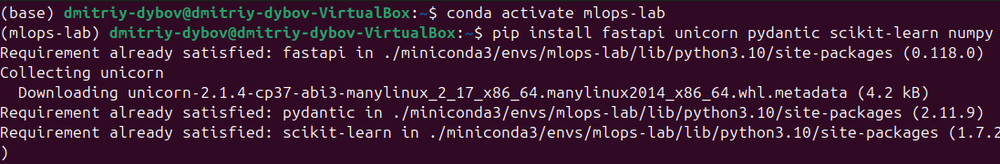 \
Рисунок 1 - Установка Java \
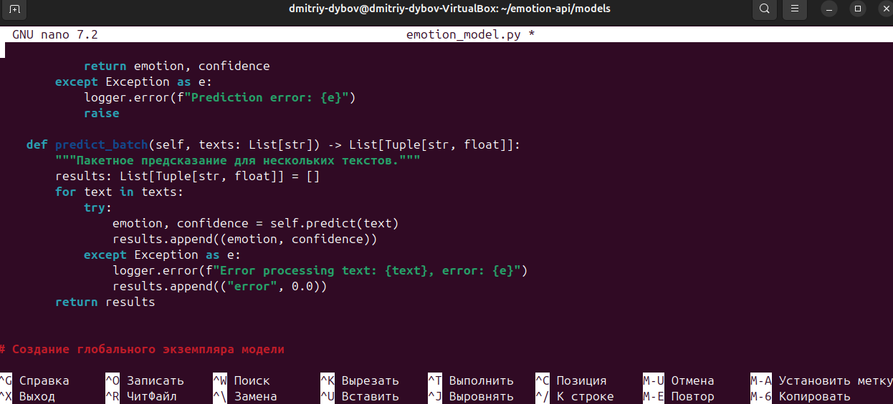 \
Рисунок 2 - Запуск Protégé

2. Загружена, изучена и сохранена образовательная онтология;
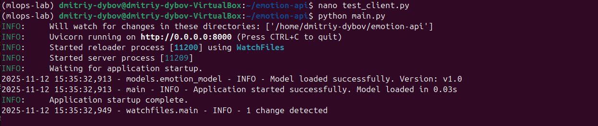 \
Рисунок 3 - Главная страница онтологии \
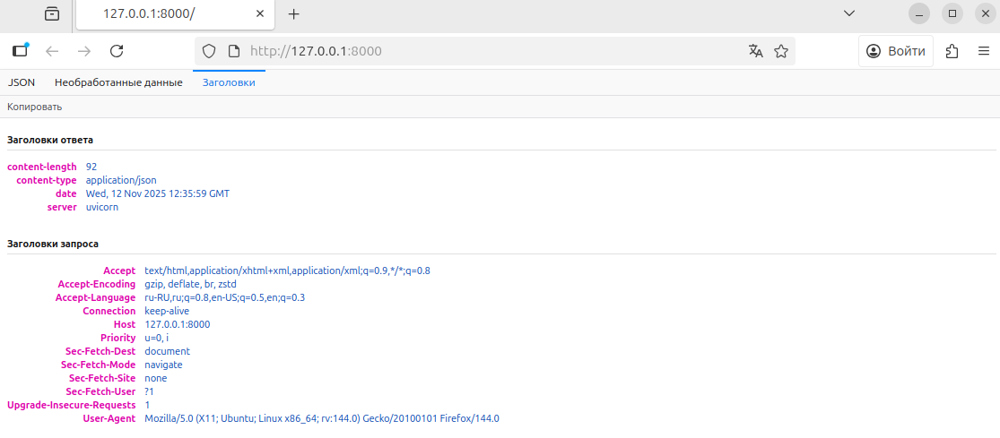 \
Рисунок 4 - Иерархия классов \
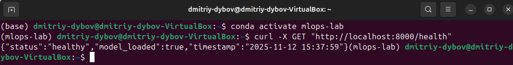 \
Рисунок 5 - Изучение объектов \
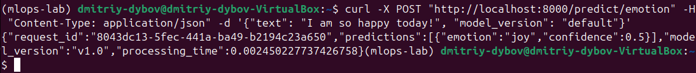 \
Рисунок 6 - Загрузка онтологии

3. Создан файл ontology_analysis.txt и записаны основные наблюдения;
 \
Рисунок 7 - Запись наблюдений

4. В класс Pizza добавлен субкласс RussianPizza, добавлены аннотация и ограничители для RussianPizza, добавлено объектное свойство; \
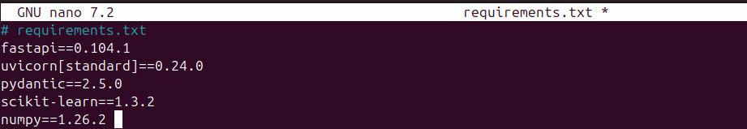 \
Рисунок 8 - Добавление субкласса \
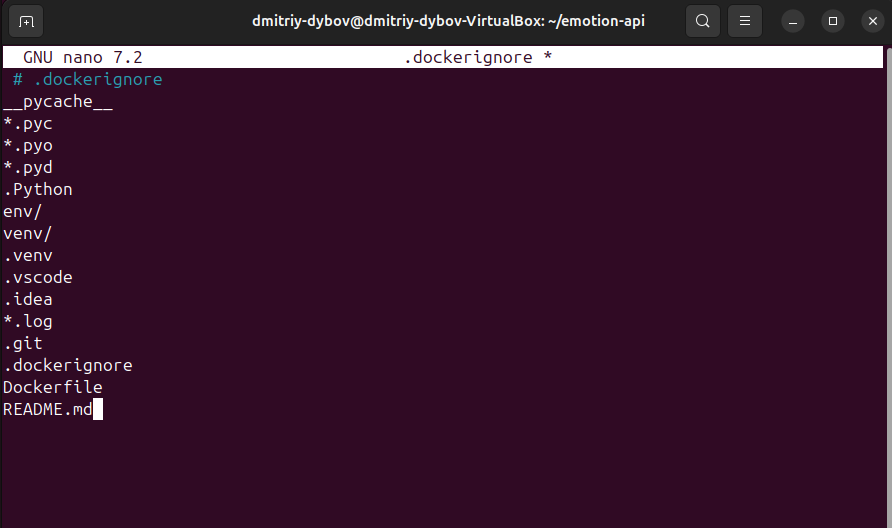 \
Рисунок 9 - Финальный вид RussianPizza \
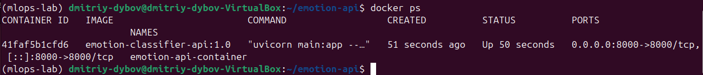 \
Рисунок 10 - Финальный вид объектного свойство

5. Запущен Reasoner, изучена автоматическая классификация пицц и выполнен запрос в DL Query на поиск пиццы с грибами;
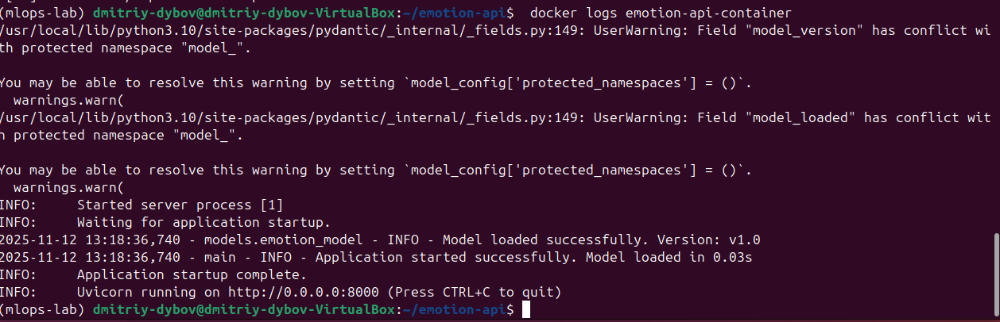 \
Рисунок 11 - Запуск Reasoner \
 \
Рисунок 12 - Проверка автоматической классификации пицц \
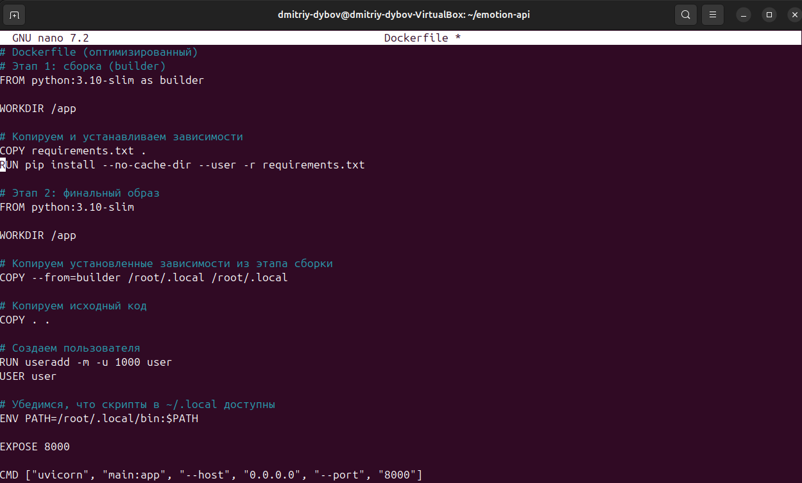 \
Рисунок 13 - Поиск пицц с грибами

6. Сохранена онтология с добавленными данными;
7. Написан и выполнен скрипт report_ontology.py для создания отчёта;
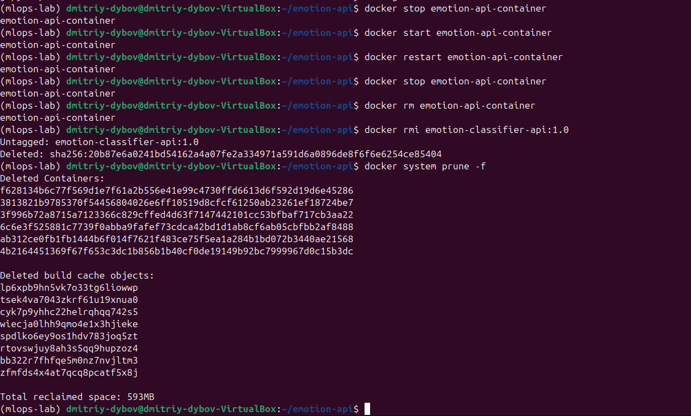 \
Рисунок 14 - Результат в командной строке \
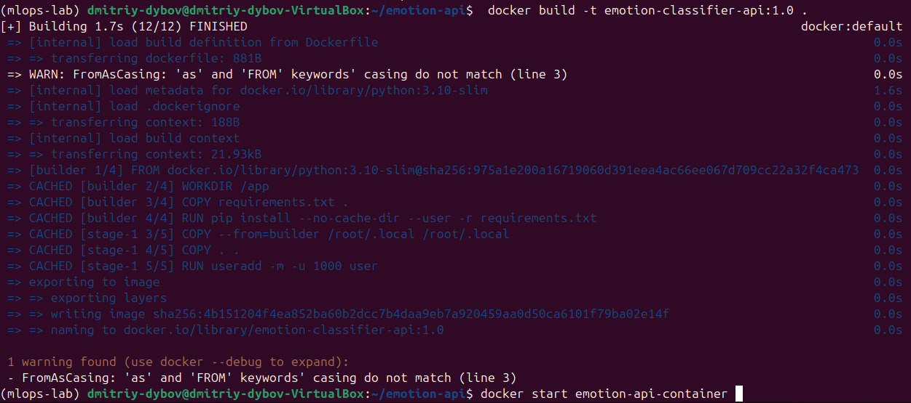 \
Рисунок 15 - Результат в сохранённом файле

8. Установлена, распакована и запущена утилита Apache Jena Fuseki;
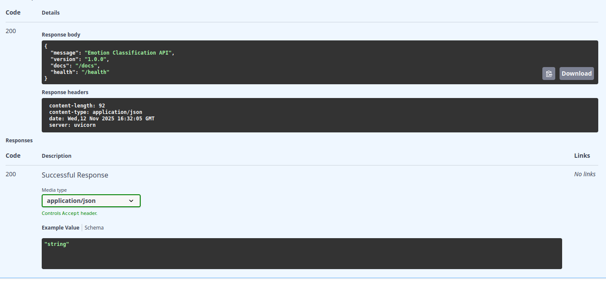 \
Рисунок 16 - Установка Apache Jena Fuseki \
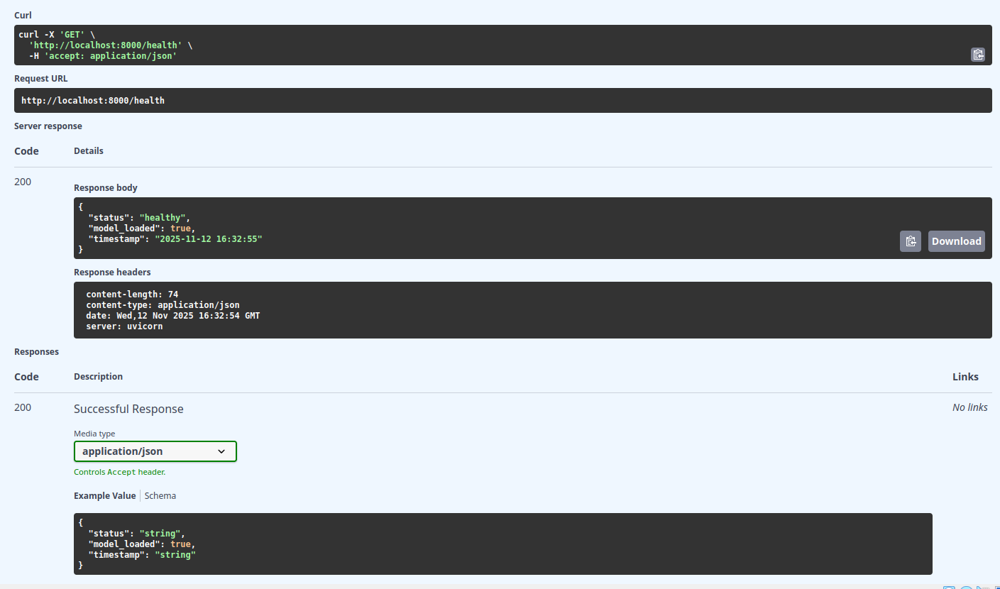 \
Рисунок 17 - Распаковка и запуск Apache Jena Fuseki

9. В Apache Jena Fuseki создан датасет, загружены RDF данные, выполнен SPARQL запрос с получением подсчёта всех триплетов;
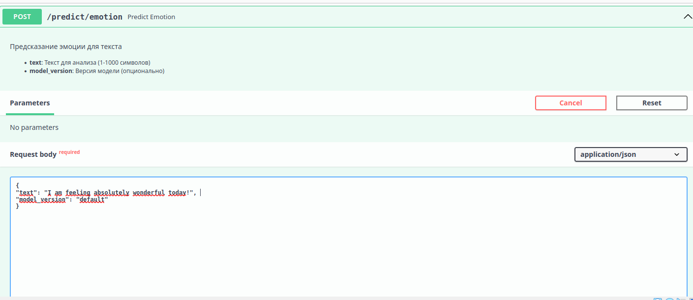 \
Рисунок 18 - Создание датасета \
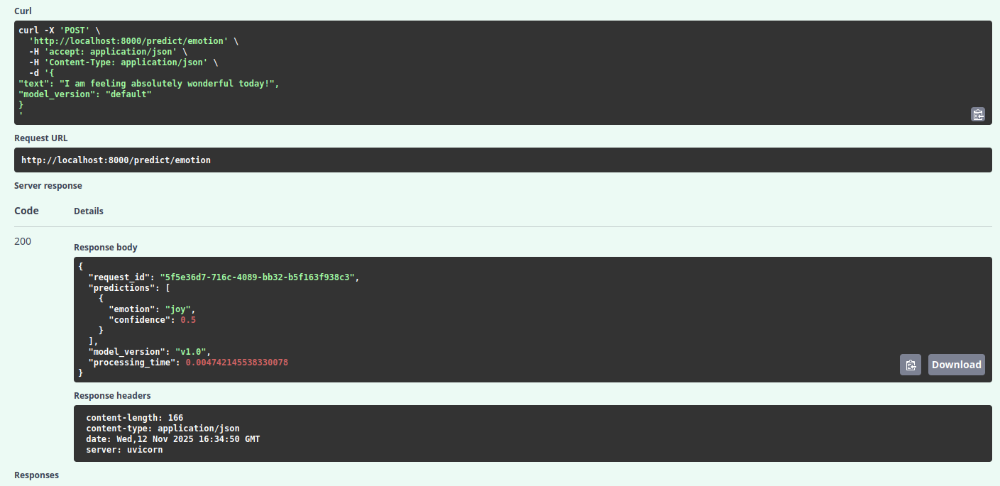 \
Рисунок 19 - Загрузка данных \
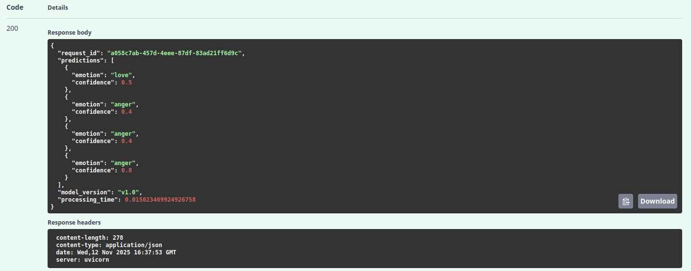 \
 \
Рисунок 20 - Выполнение запроса

11. Написаны и выполнены запросы в sparql_queries.py, получены табличные результаты и подсчёты триплетов;
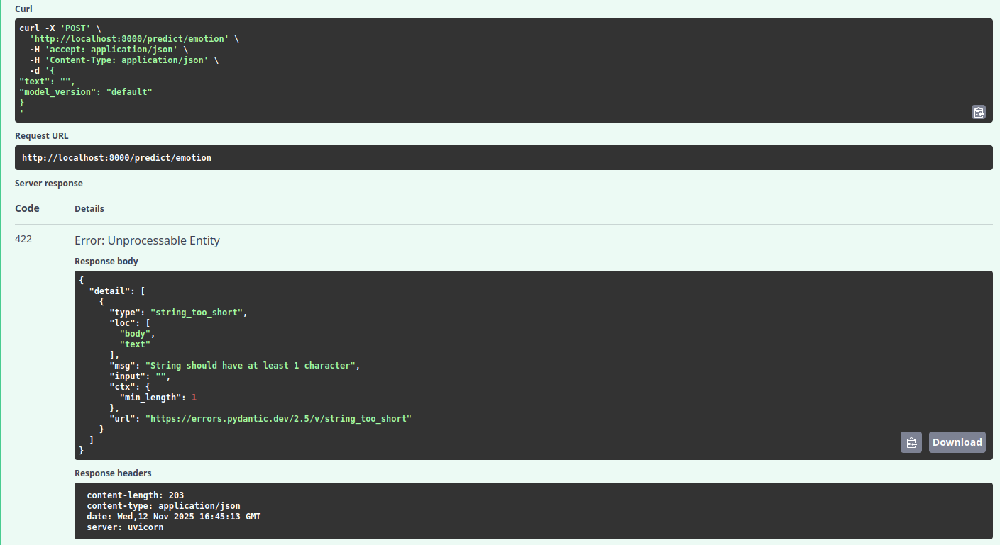 \
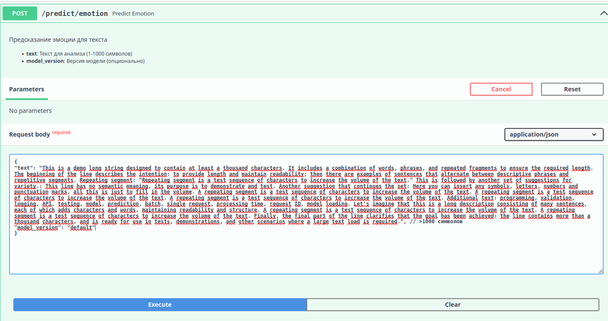 \
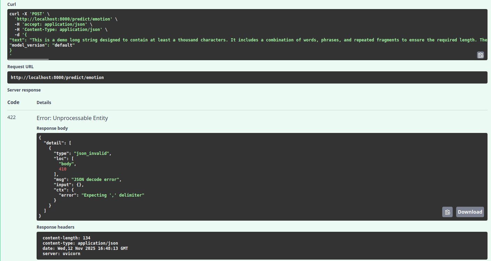 \
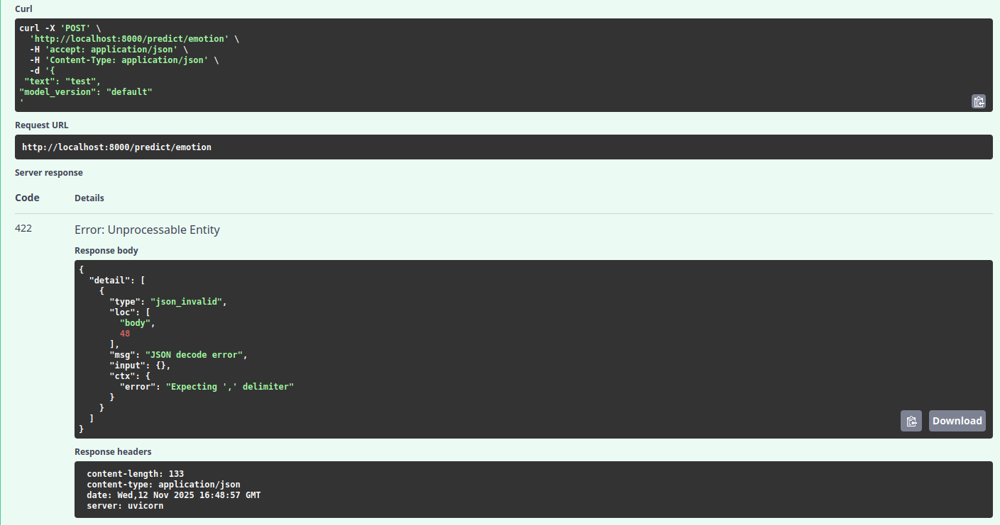 \
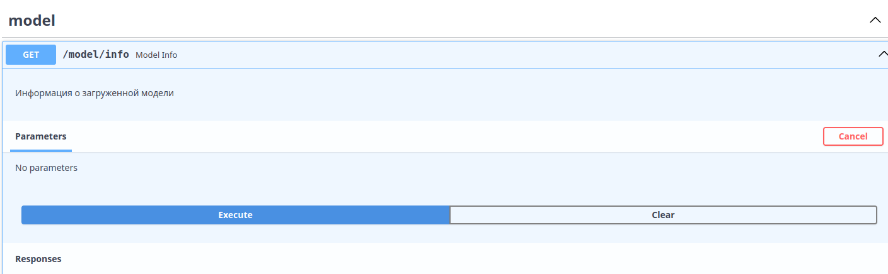 \
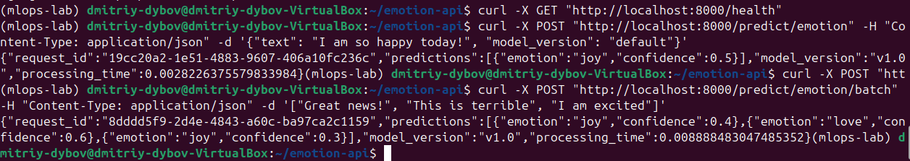 \
Рисунок 21 - Полученные результаты

12. Установлены transformers, SPARQLWrapper, rdflib, openai; 
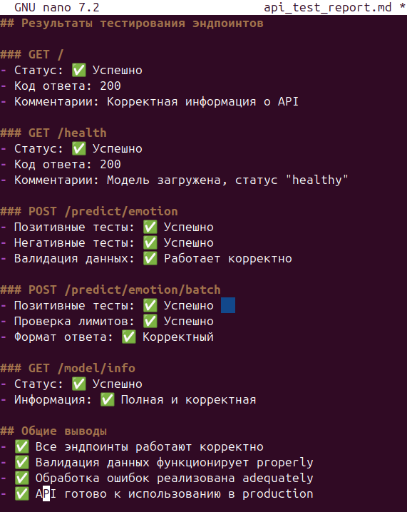 \
Рисунок 22 - Установка новых пакетов

13. Написан скрипт генерации SPARQL из текста и проверена его работа;
14. При выполнении скрипта возникли проблемы со скачиванием модели, поэтому они установдены вручную; \
 \
Рисунок 23 - Ошибка скачивания модели

15. При выполнении кода возникла ошибка "Out Of Memory" из-за недостатка оперативной памяти;
 \
Рисунок 24 - Ошибка Out Of Memory

17. Поскольку увеличить количество RAM не является возможным на данный момент, для предотвращения ошибки произведены попытки использования альтернативной модели с меньшей требовательностью и использования модели в щадящем режиме; \
 \
Рисунок 25 - Использование альтернативной модели \
 \
Рисунок 26 - Использование требовательной модели в щадящем

##### Тестирование
- [x] Модульные тесты - не применялись.
- [x] Интеграционные тесты - проверены: Protégé <-> экспорт RDF <-> Fuseki <-> SPARQLWrapper <-> LLM.
- [x] Производительность - выявлены ограничения по памяти при использовании больших LLM.

##### Ключевые файлы
- pizza.rdf - экспорт оригинальной онтологии в RDF XML
- ontology.rdf - экспорт модифицированной онтологии в RDF XML
- report_ontology.py - скрипт для извлечения данных из онтологии
- sparql_queries.py - примеры SPARQL
- llm_to_sparql.py - схема генерации SPARQL с помощью LLM

##### Выводы
Освоены базовые операции в Protégé. Загружены и отредактированы онтологии, добавлены классы, свойства и аннотации, использован reasoner. Получены практические навыки работы с SPARQL. Сформированы запросы, которые были выполнены через Fuseki и язык программирования Python. Исследована интеграция LLM для генерации SPARQL, подход работоспособен, но требует валидации и учёта ограничений по ресурсам.

##### Приложения
- Скрипты report_ontology.py, sparql_queries.py, llm_to_sparql.py находятся в папках lab-4-1, lab-4-2, lab-4-3 соответственно.
- Экспорт онтологии: ontology.ttl, ontology.rdf.
- Инструкции по запуску Fuseki и загрузке датасета (см. раздел Ключевые фрагменты кода).
- Скриншоты результатов: изображения помещены в папку report.
